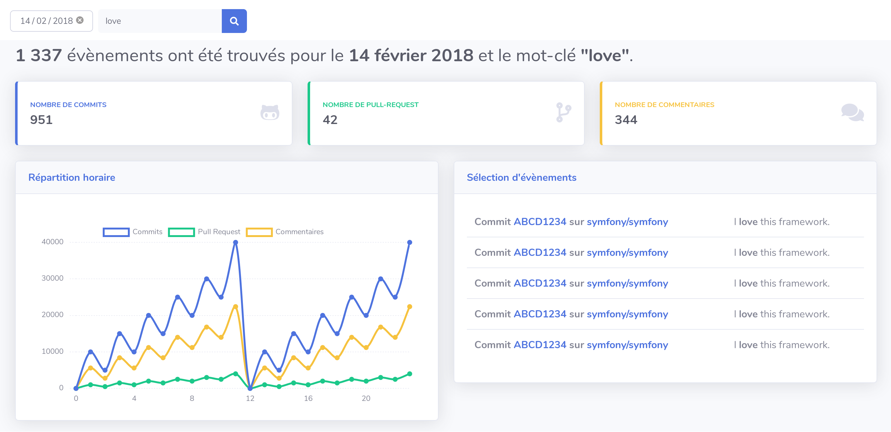

# Challenge GH Archive Keyword

## :rocket: THE project

This project aims to provide detailed statistics about Github public events (commit, pull-request, comments) related to a keyword. These data will be displayed on a day by day basis.



This project use [GH Archive](https://www.gharchive.org/) as it's single source of truth datasource. [GH Archive](https://www.gharchive.org/) is a project that record the public GitHub timeline (commit, pull requests,...), archive it, and make it easily accessible for further analysis.

## :woman_teacher: What you will have to do

### Implement events import functionality

:point_right: **Must have**

Github events will be imported by a Symfony command. Your goal is to fulfill this command in order to import Github events in our database. This command can be found here:

```
App\Command\ImportGithubEventsCommand
```

API contract and entities is already done. But feel free to adapt the code as you want.

### Refactor the project

:point_right: **Nice to have** 

This **code base does not fulfill** Yousign quality requirements.  
Feel free to adapt the code with our own standards, quality requirements and sensibilities but keep in mind the functional perimeter of the project.


## :nerd_face: Requirements
 
* Create a fork of this project
* **Must have**: Create a dedicated PR targeted on your forked project for the command
* **Nice to have**: Create a dedicated refactoring PR targeted on your forked project
* Share your project with the Yousign team

Your PR will be reviewed during our technical interview, and it will be a support to talks about your choices.

## :computer: How to use development environment

You only need `make`, `docker` and `docker-compose` installed to start the development environment.

### Start the development environment

The following command will start the development environment.
You can access to the application at http://127.0.0.1:8000/ :

```bash
make start
```

### Access to a shell in the PHP container

```bash
make shell
```

### Tests tools

You can run PHPUnit with the following command:
```bash
# Run the unit test suite
make unit-test

# init the db test (required once)
make db-test

# Run the functionnal test suite
make func-test
```

### Stop the development environment

You can stop the development environment running this command:
```bash
make stop
```

### Clean the development environment

You can clean the development environment (docker images, vendor, ...) running this command:
```bash
make clean
```

### Makefile targets

You can get available targets by running:
```bash
make
```

```bash
build                          Build the docker stack
pull                           Pulling docker images
shell                          Enter in the PHP container
start                          Start the docker stack
stop                           Stop the docker stack
clean                          Clean the docker stack
vendor                         Install composer dependencies
unit-test                      Run PhpUnit unit testsuite
func-test                      Run PhpUnit functionnal testsuite
```
**We encourage you to have fun during this challenge !**

# :muscle: Good luck !
